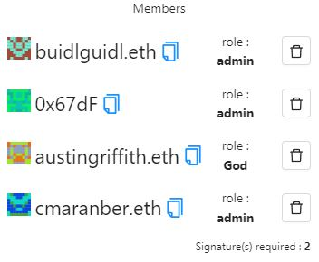
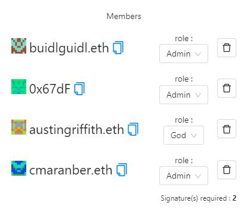
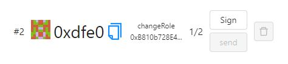
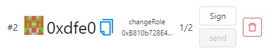
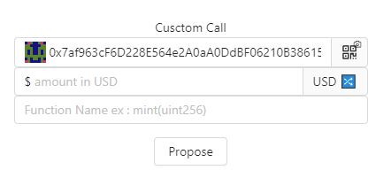
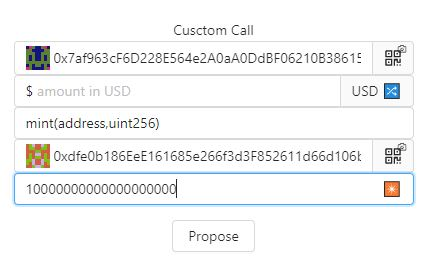

# 🏗 scaffold-eth | 🏰 BuidlGuidl | Challenge-multi-sig 👛

## 👇🏼 What I Did :

I really wanted to dive into the multisig :) Please feel free to give any feedBack about the code. 
 

 

# Added roles 

I added roles into the multisig, it definitly has to be improved. The GOD role, is just for testing it gives all the right to ... god :p If your are admin you'r allow to propose new role, and allow to remove TX from the dataBase. basacly right now it just 
user mode : 
Admin and God mode :

The same to remove a tx from the database :
user mode : 
Admin and God mode :

# Added a custom calldata 

I added a custom callData. You juste have to put the contract address that you want to call for exemple goerli testnet token (TST) : 0x7af963cF6D228E564e2A0aA0DdBF06210B38615D

You can add a mount if needed 💸.
Then add the function name (⚠️ case sensitive) with args, exemple mint(address,uint256)

Then propose and wait to the tx be signed by the members.

contract address on Goerli : 0xdfe0b186EeE161685e266f3d3F852611d66d106b

# 💬 Support Chat

Join the telegram [support chat 💬](https://t.me/joinchat/KByvmRe5wkR-8F_zz6AjpA) to ask questions and find others building with 🏗 scaffold-eth!

---

🙏 Please check out our [Gitcoin grant](https://gitcoin.co/grants/2851/scaffold-eth) too!

# TODO : 
- when role is changed the front has to refresh
